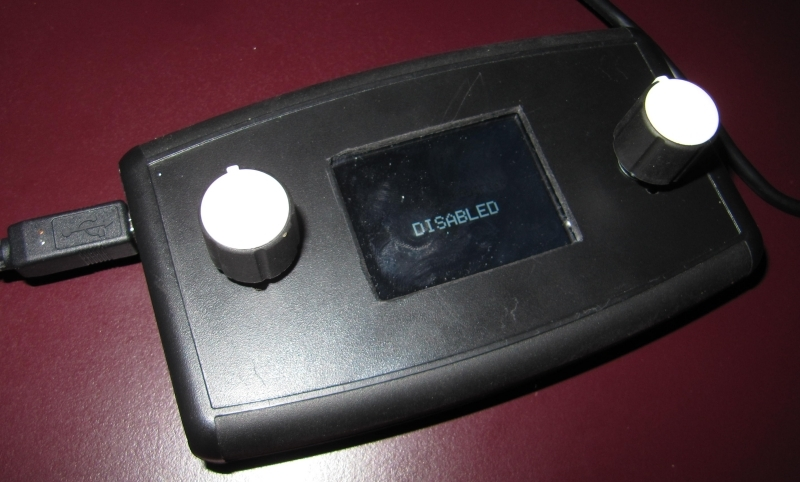
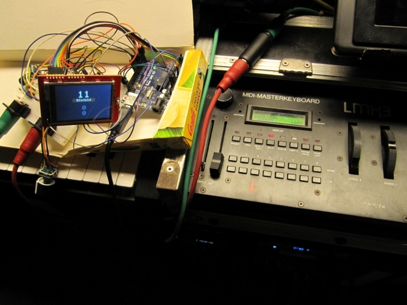
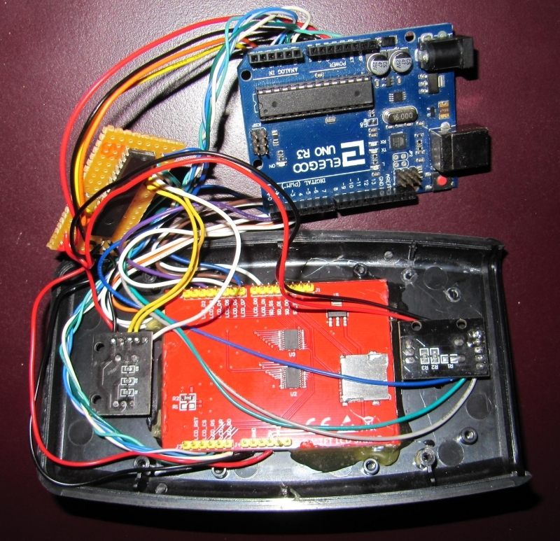
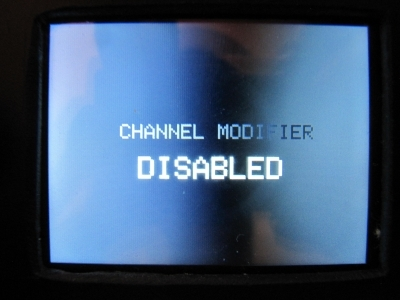
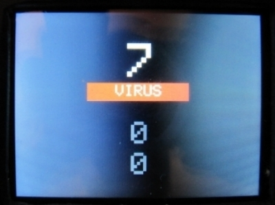
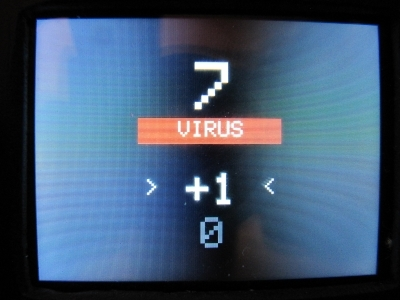
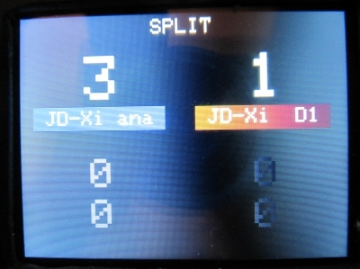

# midi-channel-modifier
Arduino based MIDI channel modifier with LCD display and rotary encoders

  


## why?
I use a `Doepfer LMK3` (88 keys) MIDI keyboard which has great features but unfortunately changing MIDI channels is a pain in the a**. The original display and potentiometer are not comfortable to read/use in case you often have to change MIDI channel(s).  

So i decided to create a MIDI-IN/MIDI-OUT Arduino (DIN-MIDI and/or USB-MIDI) with 2 rotary+push encoders and an easy to read display.  

Further the layer/split features of the `Edirol PCR-800` keyboard inspired me to implement an easy to use layer/split functionality as well.  

  

## wiring
### AZDelivery 2.4TFT LCD Touch Display
```
                        ________________________
                       |J3                    J2|
                       |_                      _|
                       |•|                    |•|
to Arduino UNO RESET <-|•|LCD_RST             |•|
   to Arduino UNO A3 <-|•|LCD_CS        LCD_02|•|-> to Arduino UNO D2
   to Arduino UNO A2 <-|•|LCD_RS        LCD_03|•|-> to Arduino UNO D3
   to Arduino UNO A1 <-|•|LCD_WR        LCD_04|•|-> to Arduino UNO D4
   to Arduino UNO A0 <-|•|LCD_RD        LCD_05|•|-> to Arduino UNO D5
                       |¯               LCD_06|•|-> to Arduino UNO D6
                       |_               LCD_07|•|-> to Arduino UNO D7
                       |•|                     ¯|
  to Arduino UNO GND <-|•|GND                  _|
                       |•|              LCD_D0|•|-> to Arduino UNO D8
   to Arduino UNO 5V <-|•|5V            LCD_01|•|-> to Arduino UNO D9
                       |•|3V3            SD_SS|•|
                       |•|               SD_DI|•|
                       |¯                SD_D0|•|
                       |J4              SD_SCK|•|
                       |                       ¯|
                       |         PINS of      J1|
                       |       AZ-Delivery      |
                       |       2.4TFT LCD       |
                       |________________________|
```

### MCP23017 for rotary/push encoders
```
                              MCP23017
                            _____ _____
                           |     U     |
                          -| 8       7 |- -> to Encoder #1 DT
                          -| 9       6 |- -> to Encoder #1 CLK
                          -| 10      5 |- -> to Encoder #1 SW
                          -| 11      4 |- -> to Encoder #2 DT
                          -| 12      3 |- -> to Encoder #2 CLK
                          -| 13      2 |- -> to Encoder #2 SW
                          -| 14      1 |-
                          -| 15      0 |-
     to Arduino UNO 5V <- -| Vdd  INTA |-
    to Arduino UNO GND <- -| Vss  INTB |-
                          -| NC    RST |- -> to Arduino UNO 5V
to Arduino UNO A5(SCL) <- -| SCL    A2 |- -> to Arduino UNO GND
to Arduino UNO A4(SDA) <- -| SDA    A1 |- -> to Arduino UNO GND
                          -| NC     A0 |- -> to Arduino UNO GND
                           |___________|
```

  


## Display
After powering the device is in bypass mode. All incoming MIDI events will be sent through.  
  

As soon as the left encoder is rotated, the display shows 3 numbers:  
 - Midi channel to transform to
 - Octave shift
 - semitone transpose

All incoming midi events will be transformed to the displayed midi channel  
  

By pushing the encoder the rotation action loops through  
 - Edit midi channel
 - Edit octave shift
 - edit semitone transpose


  


As soon as the right encoder is rotated, a 2nd transform section shows up on the display. There are 2 different modes:  

**SPLIT-Mode:** the lower and upper half of the keyboard sends to different midi channels  
**LAYER-Mode:** by pressing an key of your keyboard, the note events gets doubled and sent to 2 different midi channels.  

Of course the octave shift and semitone transpose settings gets applied in all 3 modes (single, dual-split, dual-layer)  

  

To disable the 2nd transformation (right part of the display) simply rotate the right encoder anti clockwise to channel 0.  

To go back into bypass-mode simply rotate the left encoder anti clockwise to channel 0.  

By pressing one of the encoders **for one second** you can toggle between layer- and split-mode.  

By pressing one of the encoders **for 5 seconds** the device will reboot.  

